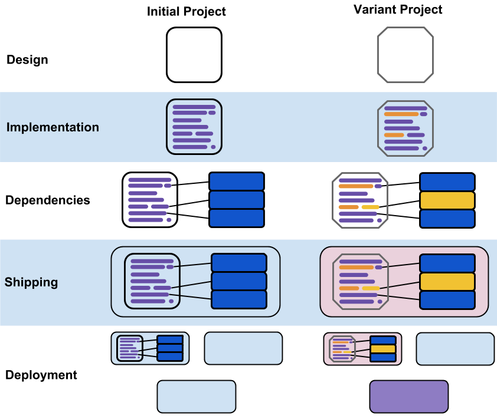
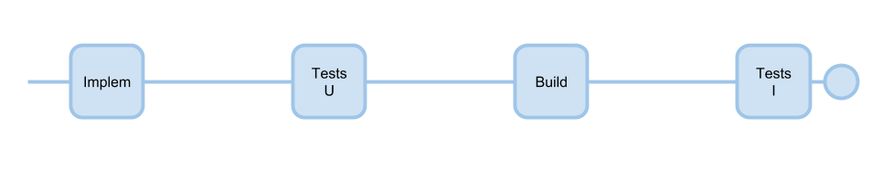
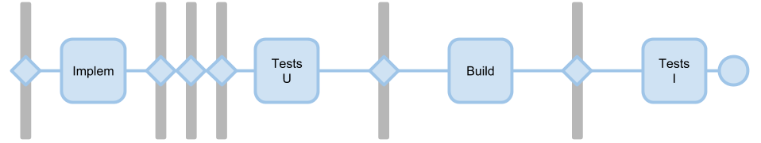
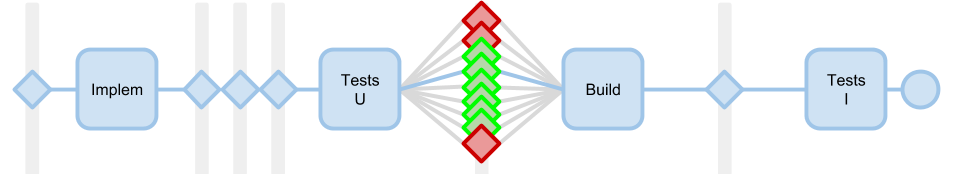
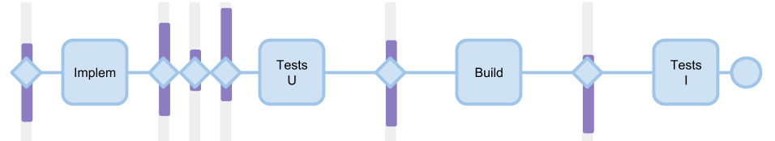
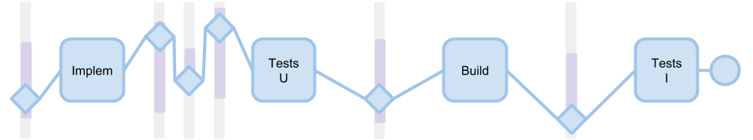

Liven is a diversity hypervisor. It enable continuous diversification in software life cycle.

## Phases

Description of the project life cycle.

Choice of the transformations points and transformations.

Explore on transformation at a time.

Assemble a diversity map.

Create diversified variants.

## Structure

See [File structure](Files.md).
